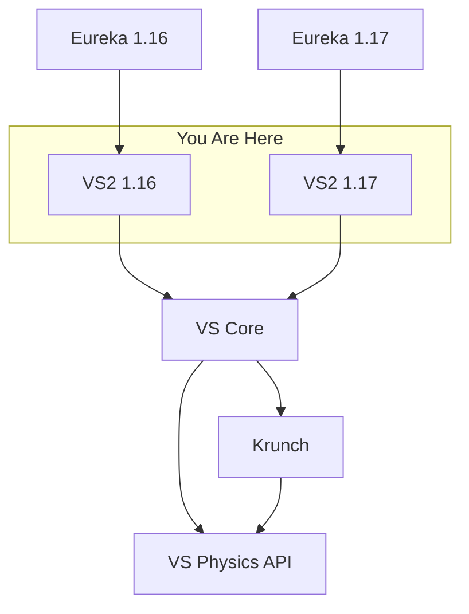
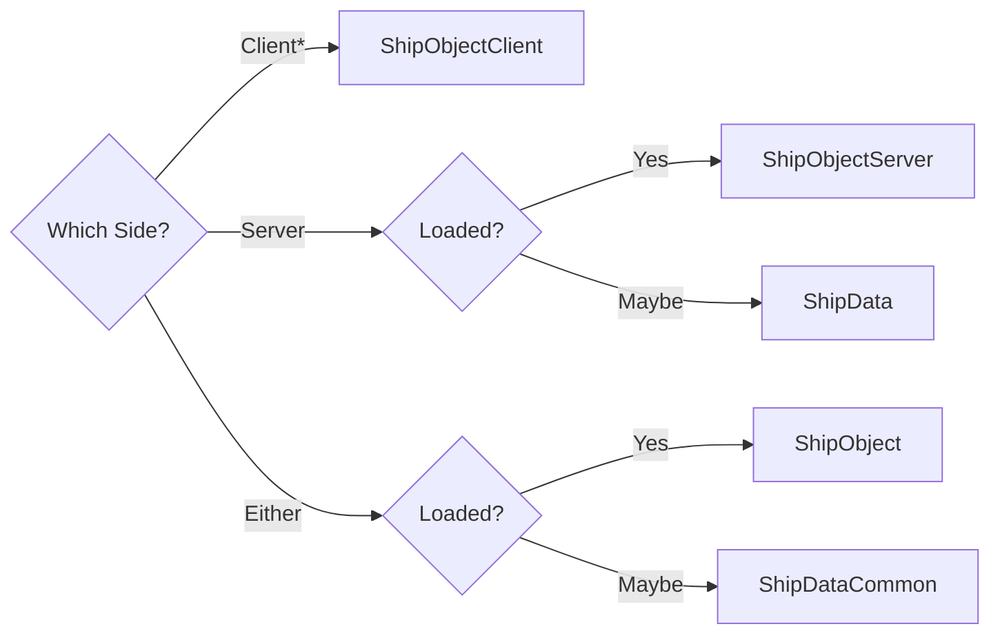

# Valkyrien Skies Architecture

## Dependency Graph (non-exhaustive)

## Chunk Claims

Each ship is allocated a portion of the world called a ChunkClaim. A Minecraft
chunk is composed of 16 blocks, a ChunkClaim is composed of 512 chunks.
ChunkClaims are unique across dimensions, which means a ship in the Overworld
could not have the same ChunkClaim as a ship in the Nether.

## Ship Class Types

What class should I use if I want to represent a ship?

* No such thing as an unloaded ship on the client
